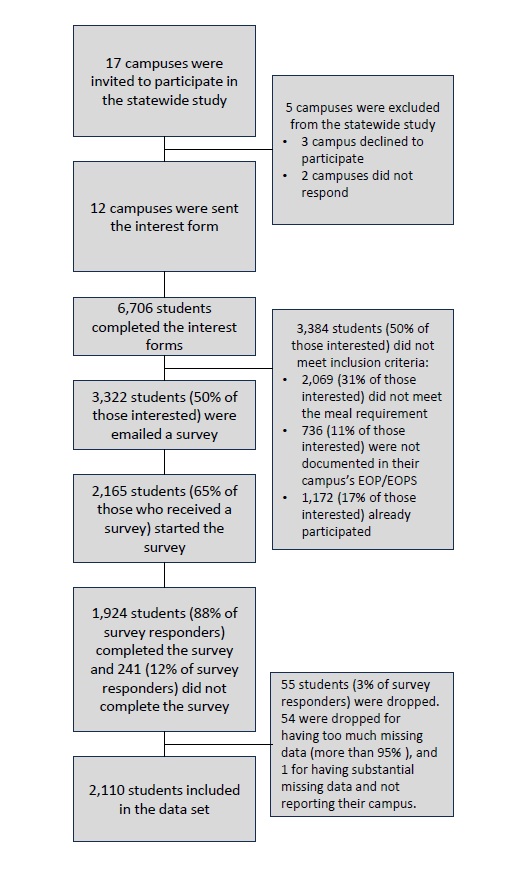
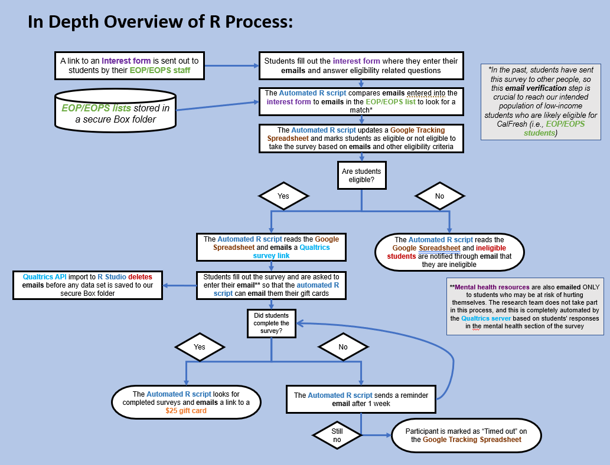
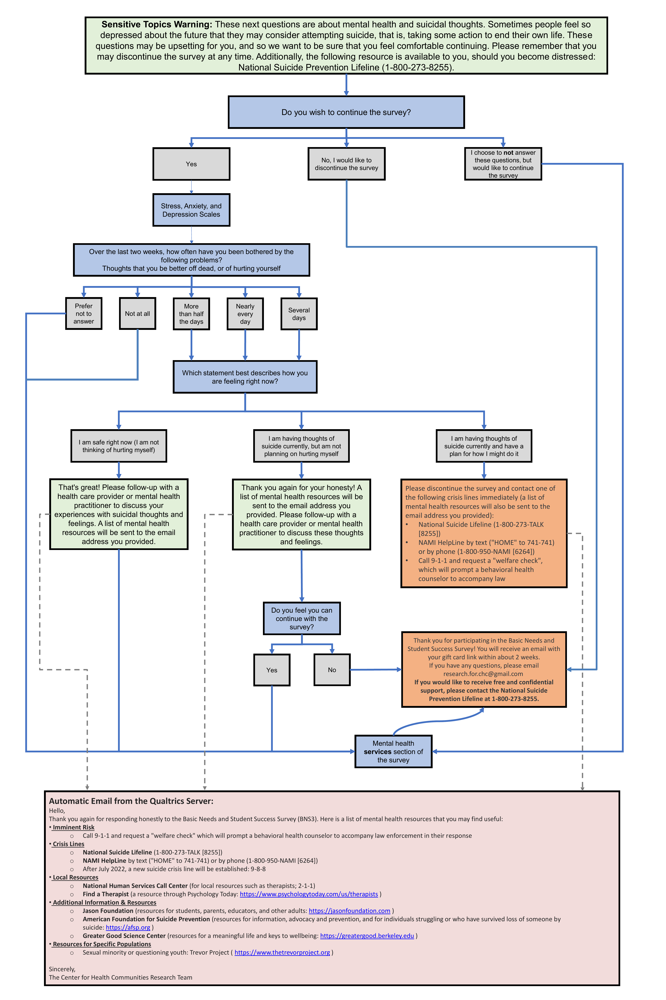

```{r, include=FALSE}
source("common_code.R")
```

## Data Collection

The following methods were performed for collecting data during the statewide study (similar methods were performed for the second pilot study). Each campus’ Institutional Review Board (IRB) was contacted, and each IRB office determined what materials were needed to approve of the research (either entering a reliance agreement with Chico State, applying to their own IRB application, or nothing will be needed). In order to ensure students were in the EOP/EOPS, EOP/EOPS staff were contacted and asked to provide us with a list of their EOP/EOPS students’ names and emails, which were also used to send the students their $25 gift card incentives upon completing the survey. In past pilots, students have sent the survey link to their friends who may not be part of the EOP/EOPS, may not be eligible for basic needs services, and/or are less likely to have used them. Using a list of EOP/EOPS students’ names/emails for an eligibility check was implemented to help recruit our target population.

<br>

:::: {.columns}

::: {.column width="50%"}

**Particpants**

-   EOP/EOPS offices assisted in the recruitment by emailing interest form links to their EOP/EOPS students.
-   Students who met the eligibility criteria of being undergraduate EOP/EOPS students and receiving less than 11 meals per week from other services (used as an eligibility criterion when determining CalFresh Food eligibility) were then emailed a survey.
-   Participants were given a \$25 gift card incentive for completing the survey.
-   EOP/EOPS students were identified as the target population for this survey based on their low-income and first-generation student status, which indicates a higher probability of using CalFresh Food and being likely eligible for CalFresh Food.
-   A total of 2,110 EOP/EOPS students in California were surveyed from the following campuses.

:::

::: {.column width="50%"}

{width=100%}

:::

::::

<style type="text/css">
.tg  {border-collapse:collapse;border-spacing:0;}
.tg td{border-style:solid;border-width:1px;font-family:Arial, sans-serif;font-size:14px;overflow:hidden;
  padding:10px 5px;word-break:normal;}
.tg th{border-style:solid;border-width:1px;font-family:Arial, sans-serif;font-size:14px;font-weight:normal;
  overflow:hidden;padding:10px 5px;word-break:normal;}
.tg .tg-9d8n{border-color:inherit;font-size:22px;text-align:center;vertical-align:top}
.tg .tg-0pky{border-color:inherit;text-align:left;vertical-align:top}
</style>

<table class="tg" border="1">
<thead>
  <tr>
    <th class="tg-9d8n" colspan="4"><span style="font-weight:bold">EOP Response Rate by Campus</span></th>
  </tr>
</thead>
<tbody>
  <tr>
    <td class="tg-0pky"><strong>Campus</strong></td>
    <td class="tg-0pky"><strong>Emails Sent</strong></td>
    <td class="tg-0pky"><strong>Survey Responses</strong></td>
    <td class="tg-0pky"><strong>Response Rate</strong></td>
  </tr>
  <tr>
    <td class="tg-0pky">Allan Hancock CC</td>
    <td class="tg-0pky">858</td>
    <td class="tg-0pky">112</td>
    <td class="tg-0pky">13.1%</td>
  </tr>
  <tr>
    <td class="tg-0pky">Butte CC</td>
    <td class="tg-0pky">387</td>
    <td class="tg-0pky">132</td>
    <td class="tg-0pky">34.1%</td>
  </tr>
  <tr>
    <td class="tg-0pky">Clovis CC</td>
    <td class="tg-0pky">481</td>
    <td class="tg-0pky">140</td>
    <td class="tg-0pky">29.1%</td>
  </tr>
  <tr>
    <td class="tg-0pky">Palo Verde CC</td>
    <td class="tg-0pky">159</td>
    <td class="tg-0pky">36</td>
    <td class="tg-0pky">22.6%</td>
  </tr>
  <tr>
    <td class="tg-0pky">Mt. Sac CC</td>
    <td class="tg-0pky">1,129</td>
    <td class="tg-0pky">270</td>
    <td class="tg-0pky">23.9%</td>
  </tr>
  <tr>
    <td class="tg-0pky">CSU Bakersfield</td>
    <td class="tg-0pky">702</td>
    <td class="tg-0pky">114</td>
    <td class="tg-0pky">16.2%</td>
  </tr>
  <tr>
    <td class="tg-0pky">CSU Dominguez Hills</td>
    <td class="tg-0pky">1,764</td>
    <td class="tg-0pky">58</td>
    <td class="tg-0pky">3.3%</td>
  </tr>
  <tr>
    <td class="tg-0pky">Cal State LA</td>
    <td class="tg-0pky">2,663</td>
    <td class="tg-0pky">343</td>
    <td class="tg-0pky">12.9%</td>
  </tr>
  <tr>
    <td class="tg-0pky">Cal State San Bernadino</td>
    <td class="tg-0pky">1,135</td>
    <td class="tg-0pky">191</td>
    <td class="tg-0pky">16.8%</td>
  </tr>
  <tr>
    <td class="tg-0pky">Sacramento State</td>
    <td class="tg-0pky">1,229</td>
    <td class="tg-0pky">253</td>
    <td class="tg-0pky">20.1%</td>
  </tr>
  <tr>
    <td class="tg-0pky">San Francisco State</td>
    <td class="tg-0pky">2,743</td>
    <td class="tg-0pky">279</td>
    <td class="tg-0pky">10.2%</td>
  </tr>
  <tr>
    <td class="tg-0pky">UC Berkley</td>
    <td class="tg-0pky">600</td>
    <td class="tg-0pky">182</td>
    <td class="tg-0pky">30.3%</td>
  </tr>
  <tr>
    <td class="tg-0pky"><span style="font-weight:bold">Total</span></td>
    <td class="tg-0pky"><span style="font-weight:bold">13,850</span></td>
    <td class="tg-0pky"><span style="font-weight:bold">2,110</span></td>
    <td class="tg-0pky"><span style="font-weight:bold">15.2%</span></td>
  </tr>
</tbody></table border="1">

<br>



<br>

## Data Management

For all questions in the survey, students had the option to decline to answer by selecting “Prefer not to answer.” All of these “Prefer not to answer” responses were coded as missing and then later imputed. Race and ethnicity were asked using the US census tool where students were first asked about their ethnicity in a single-selection multiple choice question and then their race in a select all that apply question.

::: callout-important
## Disclaimer on Missing Data

*Students had the option to select "Prefer not to answer" for all questions, or options such as "I don't know" for a small subset of questions, and these responses were set as missing values. In addition, `r get_count_and_percent(bns$finished, 'FALSE')` students did not finish the survey. These two factors are the cause of missing data (i.e., not 100% of respondents reporting). In each table/figure, the n reporting refers to the total number of non-missing responses, while the percent reporting reflects the percent of non-missing responses.*
:::

<br>

## Mental Health Skip Logic Flowchart

Due to the sensitive nature of our mental health questions we provided a specific skip logic and supporting resources. See details below.



<br>

## Survey Questions

All survey questions administered are shown on this page.

```{css}
#title-block-header .description {
    display: none;
}
```

```{css}
.embed-container {
    position: relative;
    padding-bottom: 129%;
    height: 0;
    overflow: hidden;
    max-width: 100%;
}

.embed-container iframe,
.embed-container object,
.embed-container embed {
    position: absolute;
    top: 0;
    left: 0;
    width: 100%;
    height: 100%;
}
```

```{=html}
<p class="text-center">
  <a class="btn btn-primary btn-lg download" href="`r rmarkdown::metadata$cv$pdf`" target="_blank">
    <i class="fa-solid fa-file-arrow-down"></i>&ensp;Download
  </a>
</p>

<div class="embed-container">
  <iframe src="`r rmarkdown::metadata$cv$pdf`" style="border: 0.5px"></iframe>
</div>
```
